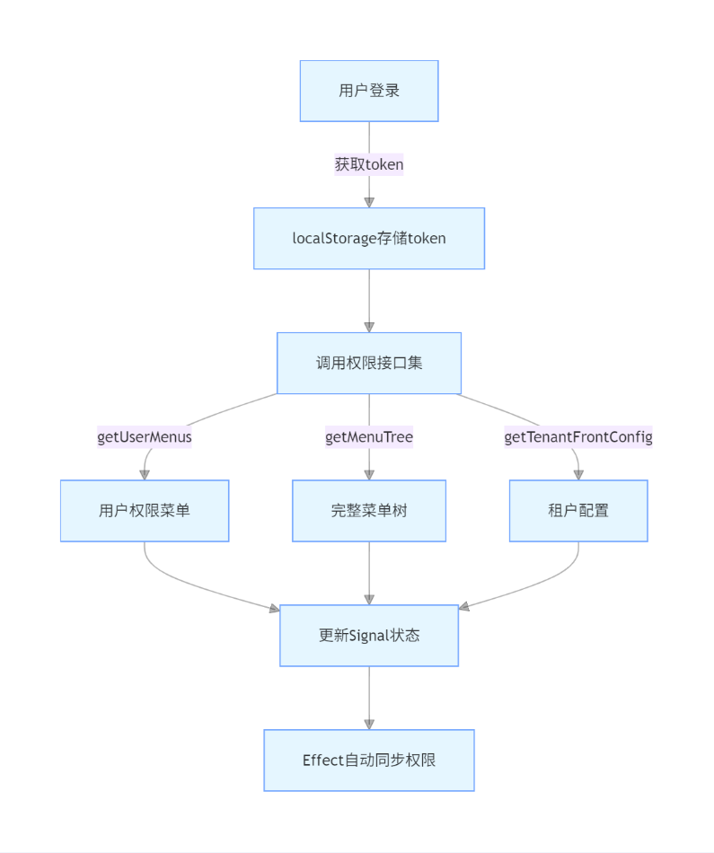

# 项目权限管理机制详解

## 一、权限体系核心架构

### 1. 权限存储机制
采用内存级响应式存储方案，而非`localStorage`：
```tsx
// 核心状态存储（内存中）
const store = signal<MainAppStore>({
  loginInfo: null,
  authorizedMenus: null,  // 用户拥有的权限菜单
  menus: null,            // 系统完整菜单树
  frontConfig: null,
});
```

**优势**：
- 内存操作性能优于本地存储
- 敏感权限数据不会持久化残留
- 响应式更新机制确保数据一致性


### 2. 权限数据流向



## 二、实时更新实现原理

### 1. 响应式核心机制
基于Preact的`Signal`响应式系统：
- 当`store.value`发生变更时，所有依赖该状态的组件和逻辑自动更新
- 无需手动调用刷新方法，实现"数据驱动UI"

### 2. 自动同步机制
通过`effect`实现权限数据自动同步：
```tsx
// 权限同步核心逻辑
effect(() => {
  utils.clear(); // 先清空旧权限数据
  
  // 处理受限权限（完整菜单树）
  treeUtils.forEachNodeV2(store?.value?.menus, [], (menu) => {
    utils.addRestrictedEndpoint(menu);
    utils.addRestrictedCode(menu);
  });
  
  // 处理授权权限（用户拥有的）
  treeUtils.forEachNodeV2(store?.value?.authorizedMenus, [], (menu) => {
    utils.addAuthorizedEndpoint(menu);
    utils.addAuthorizedCode(menu);
    utils.addAuthorizedPath(menu);
  });
});
```

**触发场景**：
- 用户角色/权限变更后重新获取权限
- 租户切换时加载新租户权限
- 系统配置更新后同步权限


## 三、权限判断体系

### 1. 多维度权限校验
```tsx
export function hasPermission(
  method: 'CODE' | 'PATH' | 'GET' | 'DELETE' | 'POST' | 'PUT',
  path: string,
  defaultValue: boolean,
) {
  switch (method?.toLocaleUpperCase()) {
    case 'CODE':    // 功能码权限（如：USER_MANAGE）
      return utils.checkCode(path, defaultValue);
    case 'PATH':    // 路由路径权限（如：/user/list）
      return utils.checkPath(path);
    default:        // API接口权限（如：POST /api/user）
      return utils.checkEndpoint(method, path, defaultValue);
  }
}
```

### 2. 组件中使用示例
```tsx
function UserList() {
  // 按钮级权限控制
  const canAddUser = hasPermission('CODE', 'USER_ADD', false);
  const canDeleteUser = hasPermission('DELETE', '/api/users', false);

  return (
    <div>
      {canAddUser && <Button onClick={handleAdd}>新增用户</Button>}
      <Table 
        dataSource={users}
        columns={[
          // ...其他列
          {
            title: '操作',
            render: (_, record) => (
              canDeleteUser && <Button danger onClick={() => handleDelete(record.id)}>删除</Button>
            )
          }
        ]}
      />
    </div>
  );
}
```


## 四、内存管理与生命周期

### 1. 数据生命周期
```
登录 → 获取权限 → 内存存储 → 权限变更时更新 → 登出/刷新 → 数据清除
```

### 2. 关键节点处理
- **登录时**：通过`load()`方法初始化权限
  ```tsx
  async function load() {
    const auth = authUtils.loadAuthorization(); // 从localStorage取token
    const loginInfo = await getUSMSLoginInfo({});
    const { authorizedMenus, menus, frontConfig } = await loadTenantInfo({ 
      tenantId: loginInfo.tenantId 
    });
    store.value = { loginInfo, authorizedMenus, menus, frontConfig }; // 更新状态
  }
  ```

- **登出时**：
  ```tsx
  function logout() {
    authUtils.removeAuthorization(); // 清除token
    redirectUtils.redirectToLogin(); // 跳转登录页
    // 页面跳转后组件卸载，内存自动释放
  }
  ```

- **页面刷新时**：
    - 内存数据清空
    - 从`localStorage`恢复token
    - 重新调用接口获取最新权限


## 五、优化建议与扩展思路

### 1. 现有机制优势
- 安全性：敏感权限数据不落地存储
- 实时性：响应式更新无需手动刷新
- 灵活性：支持多类型权限校验
- 性能佳：内存操作比IO操作更快

### 2. 可优化点
- **权限缓存策略**：
  ```tsx
  // 建议：添加短期内存缓存减少重复请求
  const permissionCache = new Map();
  async function getPermission(tenantId) {
    if (permissionCache.has(tenantId) && isCacheValid(permissionCache.get(tenantId))) {
      return permissionCache.get(tenantId);
    }
    const data = await loadTenantInfo({ tenantId });
    permissionCache.set(tenantId, { data, timestamp: Date.now() });
    return data;
  }
  ```

- **权限变更通知**：
  可引入WebSocket实现权限变更的实时推送，无需手动触发刷新

- **权限调试工具**：
  开发环境可添加权限可视化面板，方便调试权限问题

- **权限预加载**：
  对于频繁访问的页面，可预加载相关权限数据提升体验


### 3. 潜在风险点
- 页面刷新时权限加载过程中可能出现短暂的权限闪烁
- 解决方案：添加加载状态管理，权限未加载完成时显示过渡UI

- 内存数据丢失风险
- 解决方案：配合路由守卫，确保权限未加载完成时不进入功能页面


## 六、总结
该权限系统采用"内存存储+响应式更新"的设计，既保证了数据安全性，又实现了实时更新能力。通过Signal与Effect的协同工作，构建了一套高效、灵活的权限管理体系。

核心亮点在于：
1. 权限数据实时同步，无需手动刷新
2. 多维度权限校验满足复杂业务场景
3. 内存级存储提升安全性和性能
4. 自动同步机制降低开发复杂度

这种设计特别适合多租户、权限频繁变更的企业级应用场景。
```
